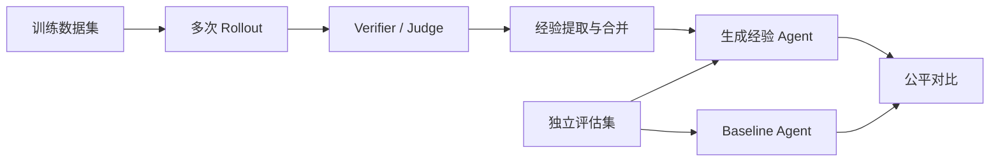

# TF-LLM

TF-LLM 是一个基于 Training-Free GRPO 的经验驱动 Agent 研究项目。项目不更新基础模型权重，而是从多次任务轨迹中提取、整理和复用经验，研究外部经验记忆是否能够稳定提升 Agent 在新任务上的表现。

> 当前阶段：基线复现、评测基础设施建设和主数据集筛选。仓库已经具备多数据集评估、经验生成和 L0/L1/L2 分层经验实现，但尚未完成经过系统实验验证的自进化闭环。

## 研究目标

项目希望逐步建立以下闭环：

1. 在固定任务上生成多条候选轨迹并获得可验证奖励。
2. 从成功与失败轨迹中提取可复用经验。
3. 将经验注入后续任务，并与相同条件的无经验 Agent 比较。
4. 根据真实效果保留、修正或删除经验。
5. 在闭环有效后，再研究分层抽象、按任务检索和跨任务迁移。

当前优先级是先证明最小经验闭环有效，再增加更复杂的自进化机制，避免多个模块同时变化后无法归因。

## 系统概览



核心入口：

- `scripts/run_eval.py`：评估 Agent。
- `scripts/run_training_free_GRPO.py`：运行经验学习。
- `configs/eval/`：评估协议。
- `configs/practice/`：经验学习协议。
- `configs/agents/practice/`：基础 Agent 与生成的经验 Agent。
- `workspace/`：经验池、审计报告和运行产物。

详细结构见 [项目架构](docs/PROJECT_ARCHITECTURE.md)。

## 安装与基础配置

推荐 Python 3.12。SkillsBench 正式实验推荐 Linux x86_64 与 Docker；其他当前数据集可在 Linux、WSL2 或 macOS 上运行。

### 自动配置

```bash
git clone --branch slim-research-baseline \
  https://github.com/lyf-workshop/TF-LLM.git
cd TF-LLM

# 可选 profile：core、korgym、skillsbench、all
bash scripts/setup/deploy.sh --profile core
```

脚本会安装 `uv` 和 Python、同步锁定依赖、创建 `.env`，并安装所选 profile 的额外组件。已有 `.env` 不会被覆盖。SkillsBench profile 仍要求系统中已经有可用的 Docker。

### 手动配置

以下命令按首次安装顺序执行。Linux 和 macOS 使用系统终端；Windows 请在 WSL2 的 Ubuntu 终端中执行 Bash 命令。

#### 1. 安装系统工具

Ubuntu、Debian 或 WSL2：

```bash
sudo apt update
sudo apt install -y git curl ca-certificates build-essential
git --version
curl --version
```

macOS：

```bash
xcode-select --install
git --version
curl --version
```

`xcode-select` 如果提示工具已经安装，可以继续下一步。

#### 2. 获取项目代码

```bash
git clone --branch slim-research-baseline \
  https://github.com/lyf-workshop/TF-LLM.git
cd TF-LLM
git branch --show-current
```

已经克隆仓库时，只需 `cd` 到仓库根目录，不要重复 clone。

#### 3. 安装 uv 和 Python 3.12

下面使用 [uv 官方提供的独立安装器](https://docs.astral.sh/uv/getting-started/installation/)：

```bash
curl -LsSf https://astral.sh/uv/install.sh | sh
export PATH=$HOME/.local/bin:$PATH

uv --version
uv python install 3.12
uv python find 3.12
```

重新打开终端后找不到 `uv` 时，再执行一次：

```bash
export PATH=$HOME/.local/bin:$PATH
```

#### 4. 创建项目虚拟环境并安装核心依赖

```bash
uv sync --locked --python 3.12
uv run python --version
```

项目命令统一使用 `uv run`，不要求手动激活 `.venv`。确实需要交互式虚拟环境时可执行：

```bash
source .venv/bin/activate
python --version
deactivate
```

#### 5. 安装可选 profile

只运行 AIME、LiveCodeBench、WebWalkerQA 或 ZebraLogic 时，核心依赖已经足够。

KORGym：

```bash
uv pip install \
  --python .venv/bin/python \
  -r requirements/korgym-runtime.txt
```

SkillsBench 先准备 Docker。Ubuntu 原生 Linux：

```bash
sudo apt install -y docker.io
sudo systemctl enable --now docker
sudo usermod -aG docker $USER
newgrp docker
docker info
```

WSL2 推荐使用 Docker Desktop。先在 Windows 管理员 PowerShell 中安装 WSL 和 Docker Desktop：

```powershell
wsl --install -d Ubuntu
wsl --status
winget install --exact --id Docker.DockerDesktop `
  --accept-package-agreements `
  --accept-source-agreements
$dockerDesktop = Join-Path $Env:ProgramFiles 'Docker\Docker\Docker Desktop.exe'
Start-Process $dockerDesktop
```

Docker Desktop 首次启动后，在设置中启用当前 Ubuntu 发行版的 WSL integration，然后回到 WSL2：

```bash
docker info
```

macOS 已安装 Homebrew 时：

```bash
brew install --cask docker
open -a Docker
```

完成首次启动和许可确认后执行：

```bash
docker info
```

等待 Docker Desktop 完成启动后再执行 `docker info`。Docker 可用后，在 Linux、WSL2 或 macOS 中继续安装固定 Harbor 版本和任务仓库：

```bash
export PATH=$HOME/.local/bin:$PATH
uv tool install --force harbor==0.3.0
harbor --version

SKILLSBENCH_REF=b63b7b2850226b6aa4fb5929a8c1ac7bc4d9a6af
if [ ! -d SkillsBench-repo/.git ]; then
  git clone https://github.com/benchflow-ai/SkillsBench.git SkillsBench-repo
fi
git -C SkillsBench-repo fetch origin $SKILLSBENCH_REF
git -C SkillsBench-repo checkout --detach $SKILLSBENCH_REF
git -C SkillsBench-repo rev-parse HEAD
```

`all` profile 的手动安装方式就是同时完成 KORGym 与 SkillsBench 两组命令。

#### 6. 创建并填写环境变量

```bash
if [ ! -f .env ]; then
  cp .env.example .env
fi
chmod 600 .env
nano .env
```

至少填写：

```dotenv
UTU_LLM_TYPE=chat.completions
UTU_LLM_MODEL=固定模型版本
UTU_LLM_BASE_URL=https://your-openai-compatible-endpoint/v1
UTU_LLM_API_KEY=your-key

UTU_DB_URL=sqlite:///test.db
UTU_LOG_LEVEL=INFO
```

需要 LLM Judge 的任务还应配置 `JUDGE_LLM_*`；网页任务还需要 `SERPER_API_KEY` 和 `JINA_API_KEY`。完整变量说明见 [配置参考](docs/reference/configuration.md)。

#### 7. 执行环境预检

按实际安装内容设置 `PROFILE`：

```bash
PROFILE=core  # 可改为 korgym、skillsbench 或 all

uv run python scripts/setup/check_environment.py \
  --profile $PROFILE \
  --check-api
```

预检全部通过后，再进入对应的数据集文档。README 不保存数据准备、训练、评估或结果查看命令，这些协议只在对应数据集文档中维护。更完整的系统说明见 [部署指南](docs/DEPLOYMENT.md)。

## 数据集文档

| 数据集 | 任务类型 | 文档 |
| --- | --- | --- |
| SkillsBench | 沙箱化专业任务 | [训练与论文对齐评估](docs/datasets/skillsbench.md) |
| LiveCodeBench | 代码生成与执行 | [训练与评估](docs/datasets/livecodebench.md) |
| AIME 2024/2025 | 数学推理 | [训练与评估](docs/datasets/aime.md) |
| WebWalkerQA | 网页搜索与信息综合 | [训练与评估](docs/datasets/webwalkerqa.md) |
| ZebraLogic | 约束逻辑推理 | [训练与评估](docs/datasets/zebralogic.md) |
| KORGym Word Puzzle | 单轮约束游戏 | [训练与评估](docs/datasets/korgym-word-puzzle.md) |
| KORGym Alphabetical Sorting | 单轮排序游戏 | [训练与评估](docs/datasets/korgym-alphabetical-sorting.md) |
| KORGym Wordle | 多轮交互游戏 | [训练与评估](docs/datasets/korgym-wordle.md) |

总览和统一实验约束见 [数据集索引](docs/datasets/index.md)。

## 文档导航

- [项目当前状态](docs/PROJECT_STATUS.md)
- [部署指南](docs/DEPLOYMENT.md)
- [项目架构](docs/PROJECT_ARCHITECTURE.md)
- [Training-Free GRPO](docs/concepts/training_free_grpo.md)
- [分层经验机制](docs/concepts/hierarchical_experience.md)
- [经验选择与检索](docs/concepts/experience_selection.md)
- [故障排查](docs/TROUBLESHOOTING.md)
- [脚本参考](scripts/README.md)
- [自进化 Agent 提案](docs/research/self_evolving_agent_design.md)
- [Self-Play 提案](docs/research/self_play_design.md)

## 实验原则

- baseline 与经验组必须使用同一数据集、模型版本、endpoint、采样参数、超时和 verifier。
- 训练集与正式评估集必须隔离。
- 网络、Docker、Harbor 和缺失产物等基础设施错误不能计为 Agent 失败。
- 每次正式运行使用新的 `exp_id`，并保存 Git commit、模型 ID、配置和时间。
- 当前生成的 Agent 和分层经验均属于实验产物，不代表已经验证的性能提升。

## 项目状态

当前研究边界、已完成工作、尚未验证内容和下一阶段计划见 [项目当前状态](docs/PROJECT_STATUS.md)。

## License

本项目继承上游 Youtu-Agent 与 KORGym 相关许可证；外部 benchmark 仍遵循各自仓库和数据集许可。
