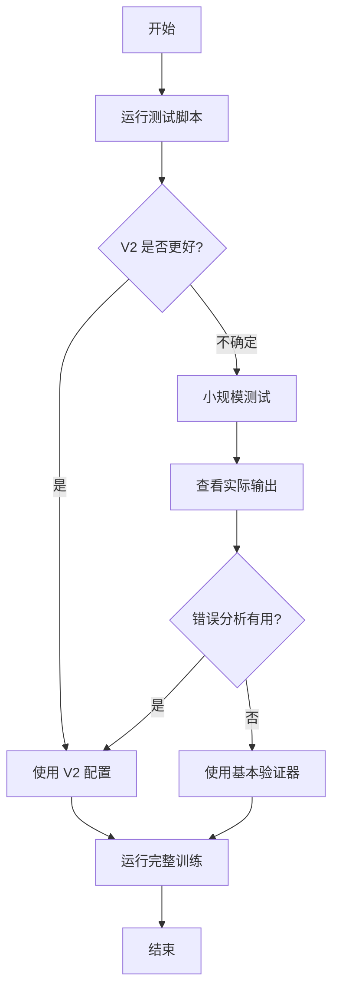

# 错误分析器 V2 快速开始

## 5分钟快速测试

### 步骤 1: 运行对比测试

```bash
cd /path/to/youtu-agent

# 查看 V1 和 V2 的差异
python scripts/test_error_analysis_v2.py
```

**期望输出**: 看到 V1 和 V2 在各种错误场景下的不同表现。

---

### 步骤 2: 选择版本

根据测试结果，选择合适的版本：

#### 选项 A: 使用 V2（推荐）

```yaml
# configs/eval/logic/your_config.yaml
verify_filename: "logic_with_error_analysis_v2.py"
verify_func_name: "verify_func"
```

#### 选项 B: 使用基本验证器

```yaml
# configs/eval/logic/your_config.yaml
verify_filename: "logic.py"
verify_func_name: "verify_func"
```

#### 选项 C: 使用 V1（不推荐）

```yaml
# configs/eval/logic/your_config.yaml
verify_filename: "logic_with_error_analysis.py"
verify_func_name: "verify_func"
```

---

### 步骤 3: 运行小规模测试

使用新配置运行一个epoch：

```bash
python scripts/run_training_free_GRPO.py \
    --agent_config configs/agents/practice/your_agent.yaml \
    --practice_config configs/practice/logic_reasoning.yaml \
    --eval_config configs/eval/logic/logic_zebralogic_practice_30_v2verify.yaml \
    --num_epochs 1
```

---

### 步骤 4: 查看错误分析效果

```bash
# 查看实际的错误分析信息
python scripts/view_actual_error_analysis.py <你的实验ID> --limit 5
```

**检查项**:
- ✅ Reasoning 字段是否简洁（100-200字符）
- ✅ 是否关注推理过程（而不是答案对比）
- ✅ 是否有可操作的建议
- ❌ 是否有误报（如"missing attributes"）

---

## 版本对比

### V1 vs V2 快速对比

| 特性                | V1                          | V2                          |
|---------------------|-----------------------------|-----------------------------|
| 分析重点            | 答案对比                     | 推理过程                     |
| 错误提示长度        | 200-400 字符                | 100-200 字符                |
| 误报风险            | 高                          | 低                          |
| 建议使用场景        | 不推荐                       | 推荐                        |

### 实际示例

**V1 输出**:
```
Found 5 logical errors in reasoning:

• Constraint Violations (3):
  1. Entity 'House 1' is missing attributes: Name, Color
  2. Entity 'House 2' is missing attributes: Name, Color
  ... and 1 more violations

• Incorrect Assignments (1):
  1. Row 2, Color: expected 'Blue', got 'Red'

• Incomplete Reasoning (1):
  1. No explicit verification of the solution against constraints
```

**V2 输出**:
```
推理过程存在以下问题：
1. 推理过程过于简短，缺少详细的推导步骤
2. 推理过程中没有明确引用问题中的线索或约束条件
```

---

## 常见问题

### Q: V2 会检测所有错误吗？

**A**: 不会。V2 只检测高价值、低误报的问题：
- ✅ 推理质量（长度、结构）
- ✅ 线索引用
- ✅ 系统化方法
- ❌ 不检测答案细节错误（基本验证器已经知道答案错了）

---

### Q: 如何禁用错误分析？

**A**: 两种方式：

**方式 1**: 使用基本验证器
```yaml
verify_filename: "logic.py"
```

**方式 2**: 使用 V2 但禁用错误分析
```python
# 需要修改代码传递参数
verify_func(sample, enable_error_analysis=False)
```

---

### Q: V2 效果不好怎么办？

**A**: 
1. 运行 `python scripts/view_actual_error_analysis.py <exp_id>` 查看实际输出
2. 如果错误提示不准确，考虑禁用错误分析
3. 如果需要自定义，可以修改 `SimplifiedLogicErrorAnalyzer` 类

---

### Q: 可以同时测试 V1 和 V2 吗？

**A**: 可以！
```bash
# 运行 V1 实验
python scripts/run_training_free_GRPO.py \
    --eval_config configs/eval/logic/config_v1.yaml \
    --num_epochs 1

# 运行 V2 实验
python scripts/run_training_free_GRPO.py \
    --eval_config configs/eval/logic/config_v2.yaml \
    --num_epochs 1

# 对比结果
python scripts/compare_training_changes.py <exp_id_v1> <exp_id_v2>
```

---

## 推荐使用流程



---

## 相关文件

- **V2 实现**: `utu/practice/verify/logic_with_error_analysis_v2.py`
- **测试脚本**: `scripts/test_error_analysis_v2.py`
- **查看工具**: `scripts/view_actual_error_analysis.py`
- **示例配置**: `configs/eval/logic/logic_zebralogic_practice_30_v2verify.yaml`
- **详细文档**: `docs/logic_error_analyzer_v2.md`

---

## 下一步

1. ✅ 运行 `python scripts/test_error_analysis_v2.py` 查看对比
2. ✅ 选择使用 V2 或基本验证器
3. ✅ 更新配置文件
4. ✅ 运行小规模测试验证效果
5. ✅ 查看实际错误分析输出
6. ✅ 应用到完整训练

祝训练顺利！ 🎉


